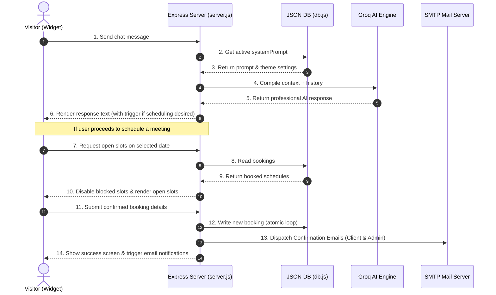

# 🚀 AnalytixHub AI Chatbot & Scheduler: Complete Technical Blueprint

This document provides a highly detailed, professional, and comprehensive architectural blueprint of the **AnalytixHub AI Chatbot & Scheduler** widget. It covers the folder structure, backend APIs, frontend layers, database schema, data pipelines, security protocols, and operational workflows.

---

## 📁 1. Project Directory Structure

Below is the directory map of the codebase, detailing the purpose of every file and folder in the repository:

```bash
ah_chatbot/
├── .env                    # Local environment variables (Port, API keys)
├── package.json            # Node.js dependencies and script configs
├── server.js               # Express application entry point (Router & Controllers)
├── data/
│   └── db.json             # Single-file JSON database (Active settings and bookings)
├── src/
│   ├── db.js               # Database abstraction layer (Atomic I/O and schema migrations)
│   └── services/
│       ├── groq.js         # AI inference service using Groq SDK (Llama 3.1 8B)
│       └── email.js        # Email confirmation dispatch pipeline (Nodemailer)
└── public/
    ├── embed.js            # Universal client embed loader (Injects widget iframe/styles)
    ├── demo.html           # Standalone sandbox page to test the embedded widget
    ├── widget/             # Chat Assistant View & Scheduler Interface
    │   ├── widget.html     # Conversational bubble markup and inline appointment steps
    │   ├── widget.css      # Premium UI glassmorphism layout & theme colors
    │   └── widget.js       # Widget logic: Web sockets, Chat feed history, and UI toggles
    └── admin/              # Management Dashboard
        ├── admin.html      # Control room (Analytics, Lead list, Settings manager)
        ├── admin.css       # Clean dashboard grid stylesheet
        └── admin.js        # Dashboard CRUD controllers (Manage settings, delete bookings)
```

---

## ⚙️ 2. Backend Architecture (`server.js` & `src/`)

The backend is built on **Node.js** and **Express**, utilizing a modular service pattern to separate database operations, email queues, and AI models.

### A. The Core Router (`server.js`)
Serves as the central API gateway. It hosts routes for:
*   💬 **`/api/chat` (POST)**: Receives a list of chat message history, adds the system-level guardrails, and feeds it to the Groq service.
*   📅 **`/api/bookings` (GET/POST/DELETE)**: Manages appointment CRUD operations.
*   🕒 **`/api/bookings/available-slots` (GET)**: Fetches occupied slots for a given day and filters against standard business hours.
*   ⚙️ **`/api/settings` (GET/POST)**: Saves chatbot preferences and masks secret fields.
*   🧪 **`/api/settings/generate-test-smtp` (POST)**: Generates free Ethereal SMTP credentials instantly to facilitate rapid local email testing.

### B. The Filesystem Database Layer (`src/db.js` + `data/db.json`)
The application relies on a robust **JSON-based database** to ensure zero configuration database overhead.
*   **Atomic Write Loop**: To prevent JSON data corruption during concurrent write calls, the database service uses atomic writing (`fs.writeFileSync` to `.tmp` files, followed by `fs.renameSync` to overwrite `db.json`).
*   **Automatic Migrations (`initDb()`)**: On startup, it compares the keys in the active `db.json` file against the default database schema. If new configuration properties are found (like color overrides or new system prompts), it automatically performs deep mergers without wiping existing databases or user bookings.

### C. The Chatbot Inference Pipeline (`src/services/groq.js`)
*   Uses the **Groq SDK** to communicate with `llama-3.1-8b-instant`.
*   On every query, it dynamically fetches the active `systemPrompt` from `db.json` and inserts it as the `system` role message before compiling user chat history.
*   Handles token constraints, temperature (0.5 for controlled, highly professional responses), and implements a detailed fallback response to handle network interruptions cleanly.

### D. The Mail Delivery Dispatch (`src/services/email.js`)
*   Operates using **Nodemailer**.
*   **Double-Dispatch Notification**: On every successful appointment, it triggers two beautiful, highly professional HTML mail outputs:
    1.  **To Client (Lead Confirmation)**: Features complete meeting details, calendar info, and custom call-to-action buttons.
    2.  **To Admin (Lead Alert)**: Notifies the business about a new consultation request, including name, contact details, and their chosen topic.
*   TLS configurations are optimized to prevent standard local security issues (e.g., Windows self-signed certificate rejections).

---

## 🎨 3. Frontend Architecture (`public/`)

The UI features a stunning, premium aesthetic using vanilla HTML5, custom CSS3 variable styling, and responsive glassmorphism.

### A. Conversational Assistant Widget (`public/widget/`)
Designed to look modern, polished, and intuitive.
*   **Interactive Toggles**: It seamlessly transitions between a traditional messaging thread and an inline scheduling wizard.
*   **Suggestions Container**: Displays glassmorphic suggestion chips that users can click to quickly trigger answers to common questions (e.g., location, services, custom scheduling).
*   **Typewriter & Typing Indicators**: Features smooth micro-animations simulating active bot thinking, providing a premium interface feel.

### B. The Inline Scheduler Step-by-Step Flow
Rather than directing users to a third-party application (like Calendly), the booking wizard is fully native:
1.  **Step 1 (Date Selection)**: Implements an interactive custom JavaScript calendar. The user navigates weeks and selects a weekday.
2.  **Step 2 (Time Selection)**: Once a date is selected, the server is checked for existing bookings. Available IST slots are dynamically rendered while conflicting slots are locked.
3.  **Step 3 (User Details)**: Gathers Name, Email, Phone, and the analytics category chosen from a drop-down.
4.  **Step 4 (Completion Card)**: A celebratory checkout screen pops up (complete with party icons) displaying booking summaries and confirming email transmission.

### C. Embedded Loader Script (`public/embed.js`)
*   Allows AnalytixHub to embed the entire widget on any site with a single `<script>` line.
*   Dynamically creates an `iframe` sandbox containing `widget.html` so that host-website global CSS rules never interfere with the widget's modern appearance.
*   Manages frame positioning, floating animation triggers, and state preservation.

### D. Settings & Control Room Dashboard (`public/admin/`)
*   Provides a clean dashboard interface to track leads.
*   Allows administrators to view all scheduled appointments and delete/cancel slots.
*   Provides textareas to customize the system prompt, greetings, and colors dynamically, with real-time SMTP connection testing.

---

## 🔒 4. Key Design Decisions & Safety Guardrails

1.  **Strict Client Confidentiality Rules**: The bot strictly filters responses. If a user inquires about specific client names (Tata, Mindsprint, Wondersoft), the prompt forces the AI model to describe clients **only by domain** (e.g., *major beverages & FMCG, leading telecommunications providers*).
2.  **Explicit Scheduler Triggers**: The calendar panel won't open without explicit intent. The backend only appends `[TRIGGER_BOOKING]` to the API output if the user explicitly asks to schedule a meeting. The frontend strips this token and presents the user with the scheduling grid.
3.  **Credential Masking**: Sensitive database fields such as `groqKey` and `smtpPass` are fully masked on the API level. They are never sent to the browser interface as plain text, eliminating security risks.
4.  **Graceful Degenerative Failure**: The application is highly resilient. If an API key is missing or the external service fails, fallback content informs the client with clear instructions on how to reach AnalytixHub directly.

---

## 🔄 5. Live Data Flow Diagram

The dynamic interaction between the components is laid out below:


